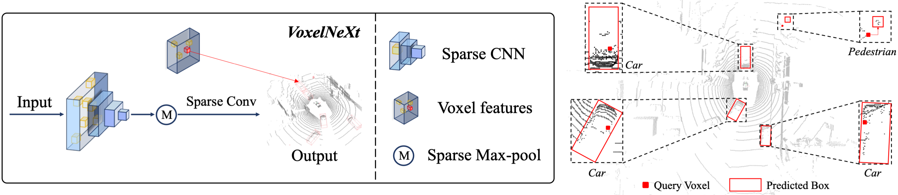

[](https://paperswithcode.com/sota/3d-object-detection-on-argoverse2?p=voxelnext-fully-sparse-voxelnet-for-3d-object-1)
[](https://paperswithcode.com/sota/3d-multi-object-tracking-on-nuscenes-lidar?p=voxelnext-fully-sparse-voxelnet-for-3d-object-1)

# VoxelNeXt: Fully Sparse VoxelNet for 3D Object Detection and Tracking (CVPR 2023)

This is the official implementation of ***VoxelNeXt*** (CVPR 2023). VoxelNeXt is a clean, simple, and fully-sparse 3D object detector. The core idea is to predict objects directly upon sparse voxel features. No sparse-to-dense conversion, anchors, or center proxies are needed anymore.
For more details, please refer to:

**VoxelNeXt: Fully Sparse VoxelNet for 3D Object Detection and Tracking [[Paper](https://arxiv.org/abs/2303.11301)]** <br />
[Yukang Chen](https://scholar.google.com/citations?user=6p0ygKUAAAAJ&hl=en), [Jianhui Liu](https://scholar.google.com/citations?user=n1JW-jYAAAAJ&hl=en), [Xiangyu Zhang](https://scholar.google.com/citations?user=yuB-cfoAAAAJ&hl=zh-CN), [Xiaojuan Qi](https://scholar.google.com/citations?user=bGn0uacAAAAJ&hl=en), [Jiaya Jia](https://scholar.google.com/citations?user=XPAkzTEAAAAJ&hl=en)<br />

<p align="center">  </p>

## News
- [2023-01-28] VoxelNeXt achieved the SOTA performance on the Argoverse2 3D object detection.
- [2022-11-11] VoxelNeXt achieved 1st on the nuScenes LiDAR tracking leaderboard. 


### Experimental results

| nuScenes Detection      |  Set |  mAP |  NDS |   Download  |
|---------------|:----:|:----:|:----:|:-----------:|
| [VoxelNeXt](tools/cfgs/nuscenes_models/cbgs_voxel0075_voxelnext.yaml)     |  val | 60.5 | 66.6 | [Pre-trained](https://drive.google.com/file/d/1IV7e7G9X-61KXSjMGtQo579pzDNbhwvf/view?usp=share_link) |
| [VoxelNeXt](tools/cfgs/nuscenes_models/cbgs_voxel0075_voxelnext.yaml)     | test | 64.5 | 70.0 |  [Submission](https://drive.google.com/file/d/1wNVjxyTuCE3F88GT_TZSgBgdmkA61Fsi/view?usp=share_link) |
| [+double-flip](tools/cfgs/nuscenes_models/cbgs_voxel0075_voxelnext_doubleflip.yaml) | test | 66.2 | 71.4 |  [Submission](https://drive.google.com/file/d/1sSkLBrWGm_rMB73cNHojGyQtz-hLBBTH/view?usp=share_link) |

| nuScenes Tracking |  Set |  AMOTA |  AMOTP |   Download  |
|---------------|:----:|:----:|:----:|:-----------:|
| [VoxelNeXt](tools/cfgs/nuscenes_models/cbgs_voxel0075_voxelnext.yaml)     | val | 70.2 | 64.0 |  [Results](https://drive.google.com/file/d/1_9maBWKJ3oDdUMBB_ee76Cq34GJoGyBx/view?usp=share_link) |
| [VoxelNeXt](tools/cfgs/nuscenes_models/cbgs_voxel0075_voxelnext.yaml)     | test | 69.5 | 56.8 |  [Submission](https://drive.google.com/file/d/1gq-vz5ix_aw4IPc0N3To15IS-bLa1b50/view?usp=share_link) |
| [+double-flip](tools/cfgs/nuscenes_models/cbgs_voxel0075_voxelnext_doubleflip.yaml) | test | 71.0 | 51.1 |  [Submission](https://drive.google.com/file/d/1wg4Iica6WbPp_NrNoXI3-J1-ggQ2_cW3/view?usp=share_link) |

|  Argoverse2  | Head Kernel | mAP | Download | 
|---------------------------------------------|:----------:|:-------:|:---------:|
| [VoxelNeXt](tools/cfgs/argo2_models/cbgs_voxel01_voxelnext.yaml) | 1x1x1 | 30.0 | [Pre-trained](https://drive.google.com/file/d/1zr-it1ERJzLQ3a3hP060z_EQqS_RkNaC/view?usp=share_link) | 
| [VoxelNeXt-K3](tools/cfgs/argo2_models/cbgs_voxel01_voxelnext_headkernel3.yaml) | 3x3x3	| 30.7 | [Pre-trained](https://drive.google.com/file/d/1NrYRsiKbuWyL8jE4SY27IHpFMY9K0o__/view?usp=share_link) | 

|    Waymo  | Vec_L1 | Vec_L2 | Ped_L1 | Ped_L2 | Cyc_L1 | Cyc_L2 |  
|---------------------------------------------|:----------:|:-------:|:-------:|:-------:|:-------:|:-------:|
| [VoxelNeXt-2D](config_file) | 77.94/77.47	|69.68/69.25	|80.24/73.47	|72.23/65.88	|73.33/72.20	|70.66/69.56 | 
| [VoxelNeXt](config_file) | 78.16/77.70	|69.86/69.42	|81.47/76.30	|73.48/68.63	|76.06/74.90	|73.29/72.18 |

- We cannot release the pre-trained models of VoxelNeXt on Waymo dataset due to the [license of WOD](https://waymo.com/open/terms).
- During inference, VoxelNeXt can work either with [sparse-max-pooling](tools/cfgs/nuscenes_models/cbgs_voxel0075_voxelnext_maxpool.yaml) or NMS post-processing. Please install our implemented [spconv-plus](https://github.com/dvlab-research/spconv-plus), if you want to use the sparse-max-pooling inference. Otherwise, please use NMS post-processing by default.

<p align="center">  </p>

## Getting Started
### Installation

#### a. Clone this repository
```shell
https://github.com/dvlab-research/VoxelNeXt && cd VoxelNeXt
```
#### b. Install the environment

Following the install documents for [OpenPCDet](OpenPCDet/docs/INSTALL.md).

#### c. Prepare the datasets. 

For nuScenes and Waymo datasets, please follow the [document](OpenPCDet/docs/GETTING_STARTED.md) in OpenPCDet.

For Argoverse2 dataset, please follow the steps in the [instruction](argoverse2/Argoverse2.md).

### Evaluation
We provide the trained weight file so you can just run with that. You can also use the model you trained.

```shell
cd tools 
bash scripts/dist_test.sh NUM_GPUS --cfg_file PATH_TO_CONFIG_FILE --ckpt PATH_TO_MODEL
#For example,
bash scripts/dist_test.sh 8 --cfg_file PATH_TO_CONFIG_FILE --ckpt PATH_TO_MODEL
```


### Training

```shell
bash scripts/dist_train.sh NUM_GPUS --cfg_file PATH_TO_CONFIG_FILE
#For example,
bash scripts/dist_train.sh 8 --cfg_file PATH_TO_CONFIG_FILE
```

## Citation 
If you find this project useful in your research, please consider citing:

```
@inproceedings{chen2023voxenext,
  title={VoxelNeXt: Fully Sparse VoxelNet for 3D Object Detection and Tracking},
  author={Yukang Chen and Jianhui Liu and Xiangyu Zhang and Xiaojuan Qi and Jiaya Jia},
  booktitle={Proceedings of the IEEE/CVF Conference on Computer Vision and Pattern Recognition},
  year={2023}
}

```

## Acknowledgement
-  This work is built upon the [OpenPCDet](https://github.com/open-mmlab/OpenPCDet) and [spconv](https://github.com/traveller59/spconv). 
-  This work is motivated by [FSD](https://arxiv.org/abs/2207.10035) for the fully sparse direction.

## Our Works in LiDAR-based 3D Computer Vision
- **VoxelNeXt (CVPR 2023)** [[Paper]](https://arxiv.org/abs/2303.11301) [[Code]](https://github.com/dvlab-research/VoxelNeXt) Fully Sparse VoxelNet for 3D Object Detection and Tracking.
- **Focal Sparse Conv (CVPR 2022 Oral)** [[Paper]](https://arxiv.org/abs/2204.12463) [[Code]](https://github.com/dvlab-research/FocalsConv) Dynamic sparse convolution for high performance.
- **Spatial Pruned Conv (NeurIPS 2022)** [[Paper]](https://arxiv.org/abs/2209.14201) [[Code]](https://github.com/CVMI-Lab/SPS-Conv) 50% FLOPs saving for efficient 3D object detection.
- **LargeKernel3D (CVPR 2023)** [[Paper]](https://arxiv.org/abs/2206.10555) [[Code]](https://github.com/dvlab-research/LargeKernel3D) Large-kernel 3D sparse CNN backbone.
- **SphereFormer (CVPR 2023)** [[Paper]](https://arxiv.org/abs/2303.12766) [[Code]](https://github.com/dvlab-research/SphereFormer) Spherical window 3D transformer backbone.
- [spconv-plus](https://github.com/dvlab-research/spconv-plus) A library where we combine our works into [spconv](https://github.com/traveller59/spconv).
- [SparseTransformer](https://github.com/dvlab-research/SparseTransformer) A library that includes high-efficiency transformer implementations for sparse point cloud or voxel data.


## License

This project is released under the [Apache 2.0 license](LICENSE).
